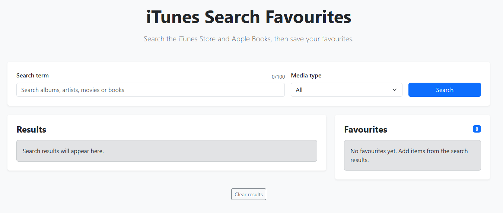
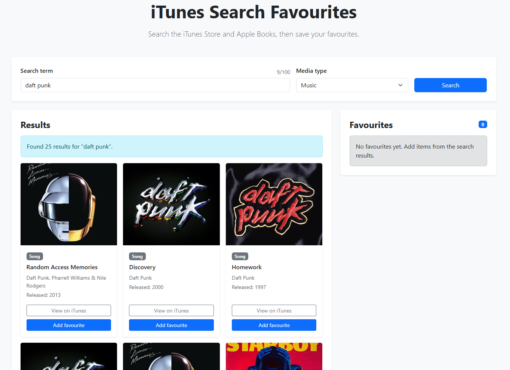
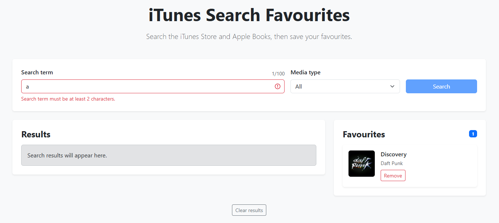

# iTunes Search Favourites

React and Express app for searching the iTunes Store and Apple Books, then saving favourite results locally.

## Overview

iTunes Search Favourites is a full-stack JavaScript project built with a React frontend and an Express backend.

The frontend lets users enter a search term, choose a media type and view matching results from the iTunes Search API. Users can save results to a favourites list, remove favourites and keep their favourites after refreshing the page.

The backend handles API requests from the frontend and calls the iTunes Search API. The search route is protected with JWT middleware.

The project is configured for a single Render Web Service deployment. In production, the Express backend serves the built React frontend from `frontend/dist`.

## Links

Live Demo: https://itunes-search-favourites.onrender.com  
GitHub: https://github.com/Mark-Mottian/itunes-search-favourites

## Tech Stack

React  
Vite  
React Bootstrap  
Formik  
Express  
Node.js  
Axios  
JWT  
iTunes Search API  
localStorage  
Docker  
Render  
Git and GitHub  

## Features

- Search the iTunes Store and Apple Books
- Filter searches by media type
- Display results in responsive cards
- Show artwork, title, artist, media type and release year
- Add results to favourites
- Remove results from favourites
- Persist favourites with localStorage
- Validate blank and short search terms
- Protect the backend search route with JWT middleware
- Use an Express backend to call the external iTunes Search API
- Serve the production React build from Express
- Deploy as a single Docker-based Render Web Service

## Screenshots

### Home Page



### Search Results



### Favourites and Validation



## How to Run Locally

Clone the repository:

```bash
git clone https://github.com/Mark-Mottian/itunes-search-favourites.git
cd itunes-search-favourites
```

## Backend Setup

Move into the backend folder:

```bash
cd backend
npm install
```

Create a `.env` file inside the `backend` folder:

```env
PORT=5000
ACCESS_TOKEN_SECRET=your_long_random_secret
NODE_ENV=development
```

Start the backend:

```bash
npm run dev
```

The backend runs on:

```text
http://localhost:5000
```

## Frontend Setup

Open a second terminal from the project root.

Move into the frontend folder:

```bash
cd frontend
npm install
```

Start the frontend:

```bash
npm run dev
```

The frontend runs on:

```text
http://localhost:5173
```

During local development, Vite proxies `/api` requests to the Express backend.

## Production Build

From the project root, run:

```bash
npm run build
```

This installs backend and frontend dependencies, then builds the React frontend into:

```text
frontend/dist
```

To test the production version locally, set the required environment variable and start the app.

On PowerShell:

```powershell
$env:NODE_ENV="production"
$env:ACCESS_TOKEN_SECRET="your_long_random_secret"
npm start
```

Then open:

```text
http://localhost:5000
```

## Docker

Build the Docker image from the project root:

```bash
docker build -t itunes-search-favourites .
```

Run the Docker container:

```bash
docker run --rm -p 5000:5000 -e ACCESS_TOKEN_SECRET=your_long_random_secret itunes-search-favourites
```

Then open:

```text
http://localhost:5000
```

The Docker setup builds the React frontend and serves it from the Express backend.

## Render Deployment

This project is deployed as a single Docker-based Render Web Service.

Render builds the app from the `Dockerfile`.

Use these settings:

```text
Service Type:
Web Service
```

```text
Language:
Docker
```

```text
Branch:
main
```

```text
Root Directory:
leave blank
```

Add this environment variable in Render:

```text
ACCESS_TOKEN_SECRET=your_long_random_secret
```

Render provides the production `PORT` automatically.

## Project Structure

```text
itunes-search-favourites/
├── backend/
│   ├── src/
│   │   ├── controllers/
│   │   ├── middleware/
│   │   ├── routes/
│   │   └── server.js
│   ├── .env.example
│   ├── package.json
│   └── package-lock.json
├── frontend/
│   ├── src/
│   │   ├── components/
│   │   ├── pages/
│   │   ├── App.jsx
│   │   └── main.jsx
│   ├── index.html
│   ├── package.json
│   ├── package-lock.json
│   └── vite.config.js
├── screenshots/
├── .dockerignore
├── .gitignore
├── Dockerfile
├── package.json
└── README.md
```

## Main Files

`backend/src/server.js` sets up the Express server, API routes, health check route and production frontend serving.

`backend/src/routes/auth-routes.js` defines the token route.

`backend/src/routes/search-routes.js` defines the protected search route.

`backend/src/middleware/auth-middleware.js` checks the JWT before allowing search requests.

`backend/src/controllers/search-controller.js` calls the iTunes Search API and returns cleaned result data.

`frontend/src/pages/HomePage.jsx` controls the main app state, API calls, search results and favourites.

`frontend/src/components/SearchForm.jsx` handles the search form, media type dropdown and validation.

`frontend/src/components/ResultCard.jsx` displays each search result.

`frontend/src/components/FavouritesList.jsx` displays saved favourites.

## What I Learned

This project helped me practise connecting a React frontend to an Express backend.

It also helped me understand how a backend can act as a safe middle layer between the frontend and an external API.

The most useful parts were working with API requests, frontend state, Formik validation, localStorage persistence, JWT middleware, Docker and production deployment setup.

## Future Improvements

If I continued developing this project, I would add user accounts so favourites could be saved to a database instead of localStorage.

I would also add automated tests for the search route and frontend validation.
